<p align="center">
  
</p>

<h1 align="center">UZH Peer Oracle</h1>

<p align="center">
  <strong>A topology-aware peer Treffpunkt for unmodified Geth teaching networks.</strong>
</p>

<p align="center">
  <a href="#quick-start">Quick Start</a> ·
  <a href="#two-node-smoke-test">Two-Node Smoke Test</a> ·
  <a href="#what-works-now">What Works Now</a> ·
  <a href="#roadmap">Roadmap</a>
</p>

---

## What This Is

`uzh-peer-oracle` is a Go-first MVP for helping private Ethereum/Geth teaching nodes find peers they can actually reach.

The oracle is a rendezvous service, not a blockchain and not a Geth fork. Each node runs a small local agent beside Geth. The agent reads local Geth state over IPC, heartbeats to the oracle, receives compatible peer recommendations, and then calls local `admin_addPeer`.

That means:

- no Geth patching;
- no Geth upgrade;
- no public Geth admin RPC;
- no manual `static-nodes.json` maintenance;
- dynamic peer exchange through local IPC.

## Target Network

| Field | Value |
| --- | --- |
| Geth | `1.10.26-stable` |
| Commit | `e5eb32acee19cc9fca6a03b10283b7484246b15a` |
| Network ID | `702` |
| Chain ID | `702` / `0x2be` |
| Consensus | Ethash / PoW |
| P2P TCP | `30308` |
| Discovery UDP | `30308` |
| Typical datadir | `~/uzhethereum/.uzhethereum` |
| Typical IPC | `~/uzhethereum/.uzhethereum/geth.ipc` |

## What Works Now

This repository currently implements **Milestone 1**, the working engine:

- `uzh-peer-oracle server` starts an HTTP oracle.
- SQLite WAL storage works.
- Seed file ingestion supports `enode://` and `enr:` lines.
- Inline metadata works: `name=... zone=... role=...`.
- Bad seed lines are reported without crashing.
- Bearer-token auth works.
- `GET /health` works.
- `POST /v1/heartbeat` works.
- `GET /v1/peers` works.
- `GET /v1/debug/nodes` works.
- `uzh-peer-oracle diagnose` talks to local Geth IPC.
- `uzh-peer-oracle agent` reads Geth IPC, heartbeats, fetches peers, calls `admin_addPeer`, and stores managed peer state.
- The agent never creates or edits `static-nodes.json`.
- Tests cover seed parsing, server API, peer selection, and fake Geth IPC.

## Wire-Level Peering Checks

`admin_addPeer` remains the only safe live insertion lever into Geth in this project. The new wire-level layer does not bypass Geth’s peer manager and does not try to force peers in from the outside.

What it adds:

- parse and inspect `enode://` and `enr:` candidates using `go-ethereum`;
- test whether the advertised TCP endpoint is actually reachable;
- store the latest probe result in the oracle database;
- boost peers that are not just claimed, but actually reachable;
- make failures diagnosable instead of mysterious.

What it does **not** do:

- no Geth patching;
- no public admin RPC;
- no packet abuse;
- no process injection;
- no `static-nodes.json` dependency;
- no `admin_addTrustedPeer`.

Useful commands:

```bash
./bin/uzh-peer-oracle wire-probe --enode "enode://..." --timeout 5s
./bin/uzh-peer-oracle wire-probe --enr "enr:..." --timeout 5s
./bin/uzh-peer-oracle diagnose-peer --config configs/agent.example.yml --enode "enode://..."
./bin/uzh-peer-oracle explain-peer-failure --config configs/oracle.example.yml --node-id A --target-node-id B
```

## Running on Contabo UZHETHPOW

For the live Contabo full node, use the Contabo-specific files in this repo:

- public IP: `157.173.125.128`
- Geth IPC path: `/home/ethereum/uzhethereum/blockchain/geth.ipc`
- Geth P2P port: `30303`
- reth occupies `30308`
- local oracle URL: `http://127.0.0.1:8787`
- live runbook: [docs/CONTABO_UZHETHPOW_LIVE_TEST.md](/mnt/d/Download/Academic%20Stuff/PhD/Codex%20Projects/uzh-peer-oracle/docs/CONTABO_UZHETHPOW_LIVE_TEST.md)

Contabo files:

- `configs/uzhethpow.contabo.oracle.yml`
- `configs/uzhethpow.contabo.agent.yml`
- `configs/uzhethpow.contabo.peers.txt`

Useful live-run commands:

```bash
./bin/uzh-peer-oracle contabo-doctor --config configs/uzhethpow.contabo.agent.yml
./bin/uzh-peer-oracle agent --config configs/uzhethpow.contabo.agent.yml --once
./scripts/contabo_peer_perf.sh 120 5
```

## Quick Start

These commands assume WSL/Linux.

```bash
cd "/mnt/d/Download/Academic Stuff/PhD/Codex Projects/uzh-peer-oracle"
```

Install/check Go:

```bash
go version
```

If Go is missing:

```bash
sudo apt update
sudo apt install golang-go
```

Build:

```bash
go mod tidy
go test ./...
make build
```

The binary will be:

```bash
./bin/uzh-peer-oracle
```

## Run The Oracle

Terminal 1:

```bash
cd "/mnt/d/Download/Academic Stuff/PhD/Codex Projects/uzh-peer-oracle"
export UZH_PEER_ORACLE_TOKEN="dev-change-me"

./bin/uzh-peer-oracle server \
  --config configs/oracle.example.yml \
  --seed configs/peers.example.txt
```

Health check:

```bash
curl http://127.0.0.1:8787/health
```

Show registered nodes:

```bash
curl -H "Authorization: Bearer $UZH_PEER_ORACLE_TOKEN" \
  http://127.0.0.1:8787/v1/debug/nodes
```

## Run The Agent

Edit the agent config:

```bash
nano configs/agent.example.yml
```

Set the Geth IPC path:

```yaml
geth:
  ipc_path: "/home/yasir/uzhethereum/.uzhethereum/geth.ipc"
```

Keep the oracle URL local for a same-machine smoke test:

```yaml
agent:
  oracle_url: "http://127.0.0.1:8787"
```

Diagnose local Geth IPC:

```bash
export UZH_PEER_ORACLE_TOKEN="dev-change-me"

./bin/uzh-peer-oracle diagnose \
  --config configs/agent.example.yml
```

Run the agent:

```bash
./bin/uzh-peer-oracle agent \
  --config configs/agent.example.yml
```

The agent will:

1. call local Geth IPC methods;
2. heartbeat to the oracle;
3. fetch recommended peers;
4. skip itself and already-connected peers;
5. call `admin_addPeer(enode)` locally;
6. store managed state in `./data/agent-state.json`.

## Two-Node Smoke Test

You need two running Geth nodes, each with its own IPC path.

Create two agent configs:

```bash
cp configs/agent.example.yml configs/agent.node-a.yml
cp configs/agent.example.yml configs/agent.node-b.yml
```

Edit node A:

```bash
nano configs/agent.node-a.yml
```

Set:

```yaml
agent:
  node_name: "node-a"
  oracle_url: "http://127.0.0.1:8787"

geth:
  ipc_path: "/path/to/node-a/geth.ipc"
```

Edit node B:

```bash
nano configs/agent.node-b.yml
```

Set:

```yaml
agent:
  node_name: "node-b"
  oracle_url: "http://127.0.0.1:8787"

geth:
  ipc_path: "/path/to/node-b/geth.ipc"
```

Run both agents:

```bash
./bin/uzh-peer-oracle agent --config configs/agent.node-a.yml
```

```bash
./bin/uzh-peer-oracle agent --config configs/agent.node-b.yml
```

Check the oracle:

```bash
curl -H "Authorization: Bearer $UZH_PEER_ORACLE_TOKEN" \
  http://127.0.0.1:8787/v1/debug/nodes
```

Check Geth peer count:

```bash
geth attach /path/to/node-a/geth.ipc --exec 'net.peerCount'
geth attach /path/to/node-b/geth.ipc --exec 'net.peerCount'
```

Confirm no static node file was created:

```bash
find ~/uzhethereum/.uzhethereum -name static-nodes.json -print
```

Expected result: both compatible nodes discover each other through the oracle and connect through local `admin_addPeer`.

## Seed File Format

Plain enodes:

```text
enode://abc...@130.60.24.247:30308
```

ENRs:

```text
enr:...
```

Inline metadata:

```text
enode://abc...@130.60.24.247:30308 # name=hub-public-1 zone=public role=hub
enr:... # name=hub-public-2 zone=public role=hub
enode://def...@10.12.3.4:30308 # name=uzh-internal-1 zone=uzh-vpn role=internal
```

Manual ingestion:

```bash
./bin/uzh-peer-oracle ingest \
  --config configs/oracle.example.yml \
  --seed configs/peers.example.txt
```

## API In Milestone 1

Unauthenticated:

```text
GET /health
```

Authenticated:

```text
POST /v1/heartbeat
GET  /v1/peers?node_id=...&limit=...
GET  /v1/debug/nodes
```

Authentication:

```http
Authorization: Bearer <UZH_PEER_ORACLE_TOKEN>
```

## Geth Flags

For public nodes:

```bash
PUBLIC_IP=<public ip>

./uzh-geth \
  --networkid 702 \
  --config "$HOME/uzhethereum/uzheth-config.toml" \
  --nat extip:$PUBLIC_IP \
  --port 30308 \
  --discovery.port 30308 \
  --v5disc \
  --maxpeers 100 \
  --maxpendpeers 100 \
  --http \
  --http.addr 127.0.0.1 \
  --http.port 8547 \
  --authrpc.addr 127.0.0.1 \
  --authrpc.port 8553
```

For Geth `1.10.26`, the flag is `--v5disc`, not `--discv5`.

## Roadmap

Milestone 1 is the current supported MVP.

| Milestone | Status | Scope |
| --- | --- | --- |
| 1 | Working MVP | server, SQLite, seed parser, heartbeat, peers endpoint, debug nodes, Geth IPC agent, `admin_addPeer` |
| 2 | Future | zones, private/public policy, peer reports, reachability graph, probe agent |
| 3 | Future | signed snapshots, dashboard, metrics, load testing |
| 4 | Future | bootnode exports, DNS discovery, devp2p helpers |

Some placeholder packages and roadmap docs already exist, but they are intentionally not part of the active Milestone 1 command surface.

## Troubleshooting

| Problem | Likely Cause | Fix |
| --- | --- | --- |
| Agent cannot connect to IPC | Wrong path or permissions | Check `geth.ipc` path and user |
| Heartbeat rejected wrong `network_id` | Geth started on the wrong network | Use `--networkid 702` |
| Heartbeat rejected wrong `chain_id` | Genesis mismatch | Check chain ID is `702` / `0x2be` |
| Public enode advertises `127.0.0.1` | NAT advertisement is wrong | Use `--nat extip:PUBLIC_IP` |
| Peer count does not rise | Firewall, wrong chain, or remote rejection | Check Geth logs and `admin.peers` |
| UDP discovery broken | UDP blocked or noisy | Oracle peering still works through TCP `admin_addPeer` |

## Safety Promise

The Milestone 1 agent only talks to local Geth IPC and writes its own managed state file. It does not edit your Geth datadir, does not create `static-nodes.json`, and does not expose admin RPC.
