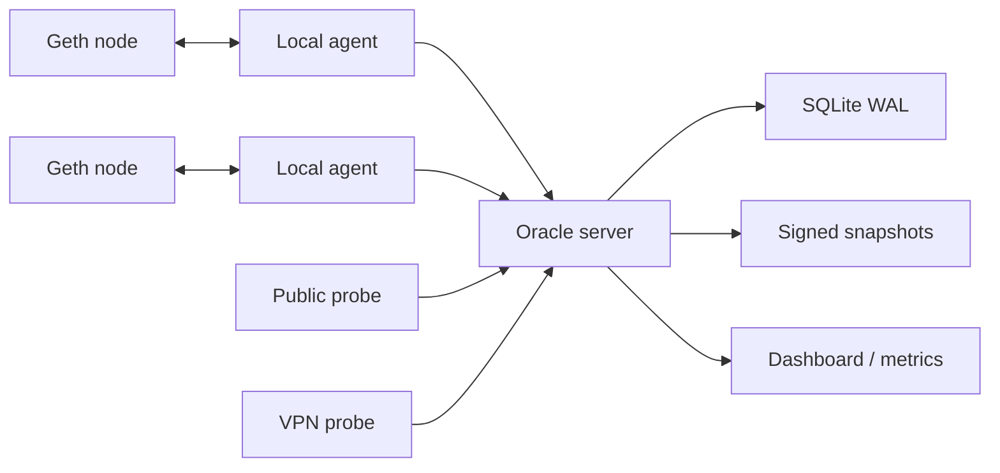

# Architecture

Status: roadmap architecture. The runnable implementation currently targets Milestone 1 only: server, SQLite, seed ingestion, heartbeat, peers endpoint, debug nodes, local Geth IPC diagnose, and local IPC agent peering.

UZH Peer Oracle is a control plane for peering, not a consensus system. Geth remains unmodified and keeps all blockchain duties. The oracle only helps nodes discover reachable peers and records why a recommendation is considered safe.

## Components

## Data Flow

1. Agent reads `admin_nodeInfo`, `admin_peers`, `net_version`, `eth_chainId`, `eth_blockNumber`, `eth_getBlockByNumber`, `net_peerCount`, and `web3_clientVersion` over local IPC.
2. Agent submits a heartbeat to `/v1/heartbeat`.
3. Oracle verifies network and chain compatibility.
4. Oracle classifies effective zones from token policy, source CIDR, zone hints, and observations.
5. Agent requests `/v1/peers`.
6. Oracle filters wrong-chain, stale, banned, self, private-leaking, and unreachable peers.
7. Agent calls local `admin_addPeer`.
8. Agent checks `admin_peers` after a delay and submits `/v1/peer-report`.
9. Probe agents periodically submit `/v1/probe-report`.
10. Oracle signs snapshots and exports curated bootnode material.

## Storage

SQLite WAL is the default because it is easy to operate for a teaching network. Tables include nodes, reachability edges, heartbeats, peer reports, probe reports, snapshots, audit events, and tokens. Postgres can be selected for larger deployments.

## Matching

The matcher ranks peers by hub role, zone locality, reachability confidence, freshness, block height, score, IP diversity, subnet diversity, and fair rotation.

Anti-eclipse behavior is built into selection:

- do not return only one hub;
- prefer at least two public anchors when possible;
- prefer a zone-local peer for private/VPN requesters;
- limit repeated peers from one subnet;
- rotate by requester and time window.
